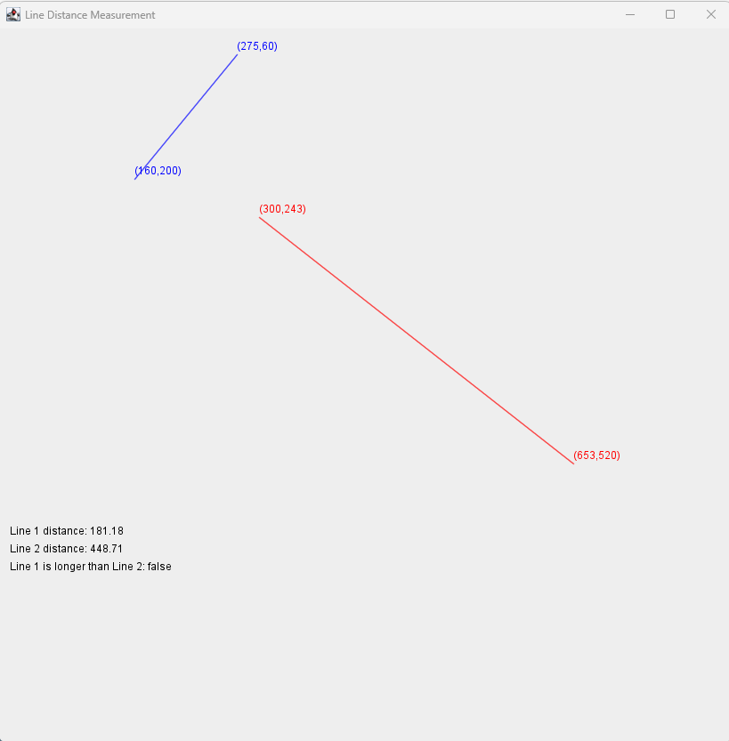

** Overview:**

You will make an application that will read in two sets of points from the user by using JOptionPane().

The applet will then draw lines between the two points in each set. Lastly we want to compare the two

lines and determine which the longer line is.

** Required skills:**

• JOptionPane

• Parsing integers using Integer.parseInt(“string value”);

• Use of variables of correct type for the job

• Use of class Math methods: Math.pow(), Math.sqrt(), Math.abs

• Relational operators with boolean statements.

• Drawing lines and Strings

• Any necessary skills from previous units. This is up to you how you use them

** Requirements:**

• You must have an application that is no larger than 650px x 650px

• You will display two lines in your application and label the start and end points

• You will calculate the lengths of the two lines and display them at the bottom of the application.

You must use the distance formula to make these calculations. You can find this formula online. You can see an example image below.

• You will display a message at the bottom that tells which line is longer. E.g. “Line 1 is longer than line 2: true” if line 1 is longer or ”Line 1 is longer than line 2 : false” if line 2 is longer. I know

that this statement is awkward, but I don’t want to force you to work with if and else. If you

know how to use if and else statements, or want to learn them on your own, you could make this message better.

• You must have instance variables for all of your points and for your distances. Your point

variables should be of type int, and your distance variables should be of type double.

• You must use JOptionPane.showInputDialog() to get user input.

• The user must enter all 4 points for the two line segments. That means that the user will enter the x and y for each of the 4 points. That will be 8 values that you need to keep track of.

• In order to cut down on the total number of variables in the program think carefully about how you can reuse variables.

• You will need to use Integer.parseInt() to convert the String that comes out of JOptionPane into a useable number.

• You must use a Boolean statement and relational operators to print out which line is longer.

** Outcome:**

